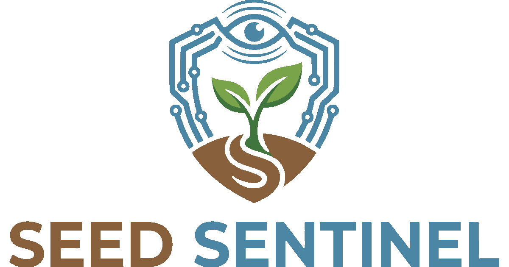

## Project Overview
Seed Sentinel is an open-source system that gives your plants a voice. By combining low-cost soil sensors with an AI-powered botanist, it translates real-time soil data into actionable care instructions. It’s a transparent solution designed to help anyone grow plants successfully, free from proprietary lock-ins.

    
     
    

